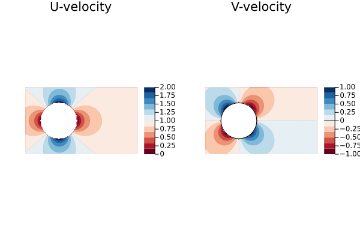
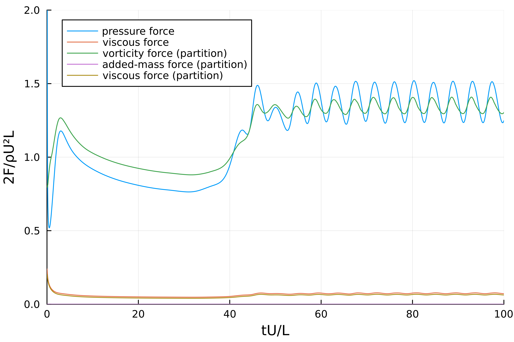
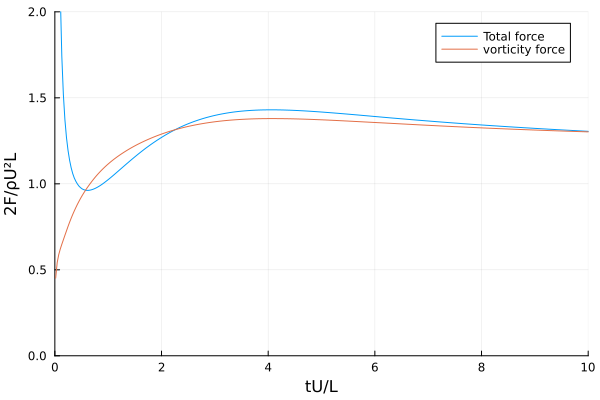
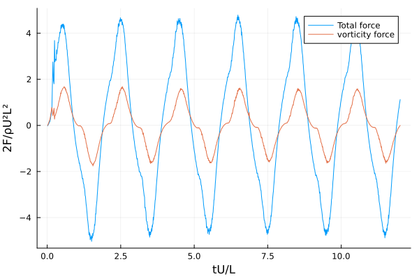

<!-- [](https://github.com/marinlauber/ForcePartition.jl/actions/workflows/CI.yml?query=branch%3Amain) -->
> **_NOTE:_** This package is still under development, as such some bugs might still be present.

#### Task list
- [x] add 3D example
- [ ] write tests
- [x] add kinematic and viscous contributions
- [ ] validate with article
- [ ] fix moment in 2D/3D
- [ ] fix sharp geometries
- [ ] add documentation 
---

# ForcePartition.jl

The repo contains a Julia implementation of the force partition method (FPM) for the computation of the force and moment acting on a body immersed in a fluid flow. The method is based on the work of 
[K. Menon and R. Mittal](https://doi.org/10.1016/j.jcp.2021.110515)[K. Menon and R. Mittal](https://arxiv.org/pdf/2006.11649) and the examples shown here replicate the examples presented in their paper.

This code has been written with the aim of applying it directly within [WaterLily.jl](https://github.com/weymouth/WaterLily.jl) simulations and is therefore tailored to the specific needs of that package. However, it can be used as a standalone package for the computation of forces and moments on a body immersed in a fluid flow.

### Force and Moment Partition Method


The force partition relies on the computation of an _influence field_ $\phi_i$ (or similarly for the moment partition, $\psi_k$) that satisfies the following __homogeneous Poisson equation__:
```math
    \nabla^2ϕ_i = 0, \quad\text{with}\quad \hat{n}\cdot\vec\nabla\phi_i=\begin{cases}
        n_i & \forall x ∈ ∂\mathcal{B} \\
        0  & \forall x ∈ ∂\mathcal{\Omega} 
    \end{cases}
```
which is (equivalent to) the classical potential flow generated by a uniform flow in the $i^{th}$ direction around a static body $\mathcal{B}$ in a domain $\Omega$, see Figure above.



Similarly, the moment partition is computed by solving a similar Poisson equation for the moment field $\psi_k$, __the boundary condition are different here__
```math
\nabla^2ψ_k = 0, \quad\text{with}\quad \hat{n}\cdot\vec\nabla\psi_k=\begin{cases}
        \left[(\vec{X}-\vec{X_c})\times\hat{n}\right] ⋅ \hat{e}_k & \forall x ∈ ∂\mathcal{B} \\
        0  & \forall x ∈ ∂\mathcal{\Omega}
    \end{cases} 
```
In the code, generating a force/moment partition is done by first creating a `ForcePartitionMethod` object that holds the implicit geometry representation and the poisson solver for the influence field
```julia
fpm = ForcePartitionMethod(sim,x₀=SA[0.,0.])
```
where `sim` is a `WaterLily.Simulation` object that holds the flow field and the geometry of the body. The `x₀` argument specifies the origin of the coordinate system in which the moments are computed (for forces, this is irrelevant).

> **_NOTE:_** If you just want to use this library to compute the influence field, you will need to generate a dummy WaterLily simulation object with the flow field and the geometry of the body. This is because the influence field is computed by solving a Poisson equation with the boundary conditions specified by the geometry of the body and using the Poisson solver from WaterLily. 


#### Vorticity-induced component

The vorticity-induced component of the force can be expressed as
```math
    C_{F_i}^\omega = -2\int_{\Omega} Q\phi_i\text{ d}Ω - \varepsilon_{F_i}^\Phi\,,\quad C_{M_k}^\omega = -2\int_{\Omega} Q\psi_k\text{ d}Ω - \varepsilon_{M_k}^\Phi
```
where $Q$ is the second invariant of the velocity-gradient tensor $Q=\frac{1}{2}\left(\Vert\bf{\Omega}^2\Vert-\Vert\bf{S}^2\Vert\right)$ where $\bf{\Omega}$ and $\bf S$ are the anti-symmetric and symmetric parts of the velocity gradient tensor, respectively. 

The terms $\varepsilon_{F_i}^\Phi$ and $\varepsilon_{M_k}^\Phi$ are the partition of the effects of purely irrotational flow from rotational flow-dependent contributions associated with $Q$. These are assumed to ne negligible in the present implementation (as is done in the original paper).

To compute the part of the force partition with the code we must first create a `ForcePartitionMethod` object and then call the `∫2Qϕ!` function that computes the vorticity-induced component of the force partition

```julia
fpm = ForcePartitionMethod(sim)
Qω = -∫2Qϕ!(fpm,sim.flow,tᵢ,x₀,axis=1,recompute=true)
```
the `recompute` argument specifies whether the influence field should be recomputed or not (this basically depends if you have a moving/deforming body or not). The `axis` argument specifies the direction of the force/moment to be computed. Values `1`, `2` and `3` correspond to the force on the `x`, `y` and `z` axis, respectively, whereas `4`, `5` and `6` correspond to the moment around these axis.

#### Kinematic and viscous components

The kinematic and viscous components of the force can be expressed as
```math
    C_{F_i}^κ = -\int_{\mathcal{B}} 
\hat{n}\cdot\left(\frac{\text{d}\vec{U}_\mathcal{B}}{\text{d}t}\phi_i\right)\text{ d}S\,,\quad  C_{M_i}^κ = -\int_{\mathcal{B}} 
\hat{n}\cdot\left(\frac{\text{d}\vec{U}_\mathcal{B}}{\text{d}t}\psi_i\right)\text{ d}S
```
where $\vec{U}_\mathcal{B}$ is the velocity of the body and $\hat{n}$ the unit normal vector. The viscous component of the force can be expressed as
```math
 C_{F_i}^\sigma = -\int_{\mathcal{B}} \frac{1}{Re}\left\{(\vec{\omega}\times\hat{n})\cdot\vec{\nabla}\phi_i - (\vec{\omega}\times\hat{n})\cdot\hat{e}_i \right\}\text{ d}S\,,\quad\\ C_{M_i}^\sigma = -\int_{\mathcal{B}} \frac{1}{Re}\left\{(\vec{\omega}\times\hat{n})\cdot\vec{\nabla}\phi_i - (\vec{\omega}\times\hat{n})\cdot\left[\hat{e}_i\times\left(\vec{X}-\vec{X}_c\right)\right] \right\}\text{ d}S
 ```
where $Re$ is the Reynolds number of the flow and $\vec{X}_c$ is the point of application of the moment.


### Examples

The examples shown here replicate the examples presented in the paper by [K. Menon and R. Mittal](https://doi.org/10.1016/j.jcp.2021.110515). The examples are:

#### 2D flow around a cylinder

This is the classical flow around a 2D cylinder. The example file can be found [here](assets/cylinder.jl) 


The result of the force partition is shown below, we comapre the total pressure force acting on the cylinder with the vorticity component of the force. The total force is computed by integrating the pressure field over the surface of the cylinder, while the vorticity component is computed by the force partition method. The results are shown below



#### 2D flow around a pitching airfoil

TBF


#### 3D flow around a sphere



#### 3D flow around a mosquito wing

The file to replicate this case in the examples folder is [here](assets/ThreeD_Dickinson.jl)



The potentials for the z-lift for two wings is


